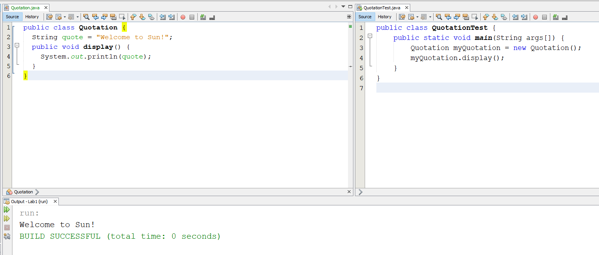
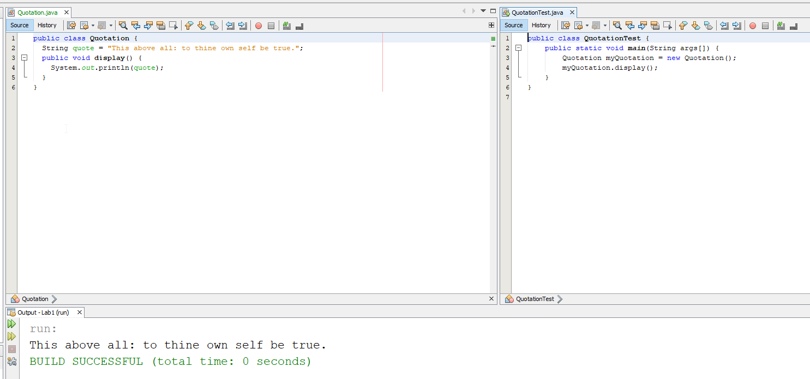
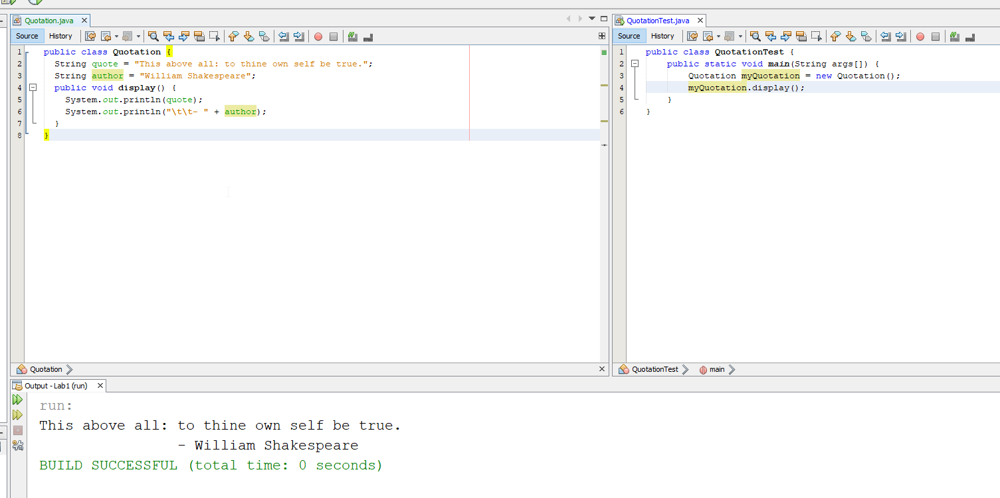

# Завдання 2. Створення та запуск іншої програми (цитати)


1. Додайте в проект (до теки `src`) файл `Quotation.java` з таким вмістом:
```Java
public class Quotation {
  String quote = "Welcome to Sun!";
  public void display() {
    System.out.println(quote);
  }
}
```

2. Збережіть файл, у разі необхідності (аби "навести красу" з відступами) скористайтесь швидким форматуванням - `ALT`+`SHIFT`+`F`
3. Відкрийте файл `QuotationTest.java` з цього репозиторію
4. Запустіть його (`F6` у `NetBeans` для запуску головного виконуваного файлу, `SHIFT`+`F6` - для запуску поточного файлу)
5. зробіть та збережіть (тека `Solution`) у файл `task2.1.png` скріншот результатів роботи програми


6. замініть у файлі `Quotation.java` текст довільною цитатою, знайденою в Мережі
7. запустіть файл повторно
8. зробіть та збережіть (тека `Solution`) у файл `task2.2.png` скріншот нових результатів роботи програми


9. На "п'ять" - те, що на "чотири", плюс, змінити код завдань таким чином, щоб:
окрім цитати виводилось ім'я того, кому вона належить

